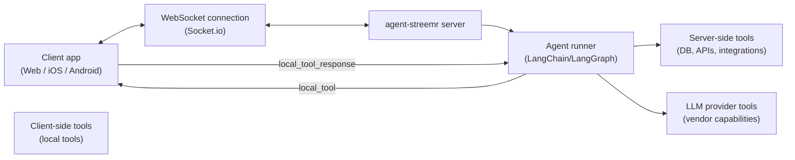
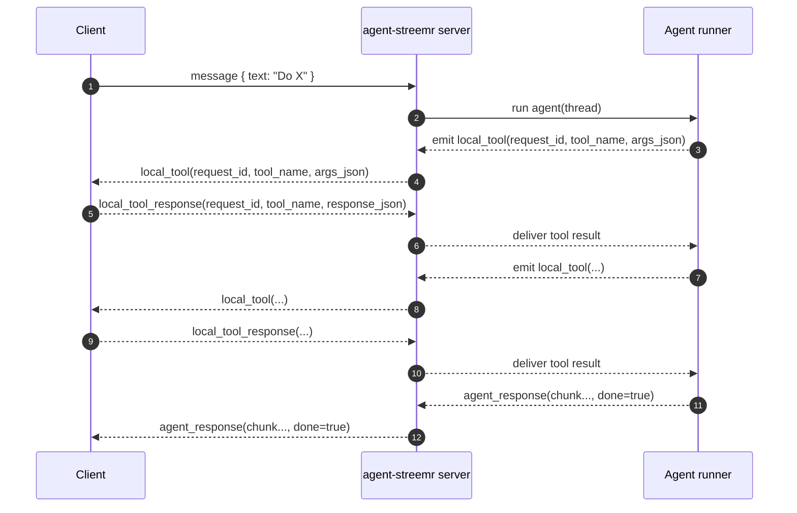
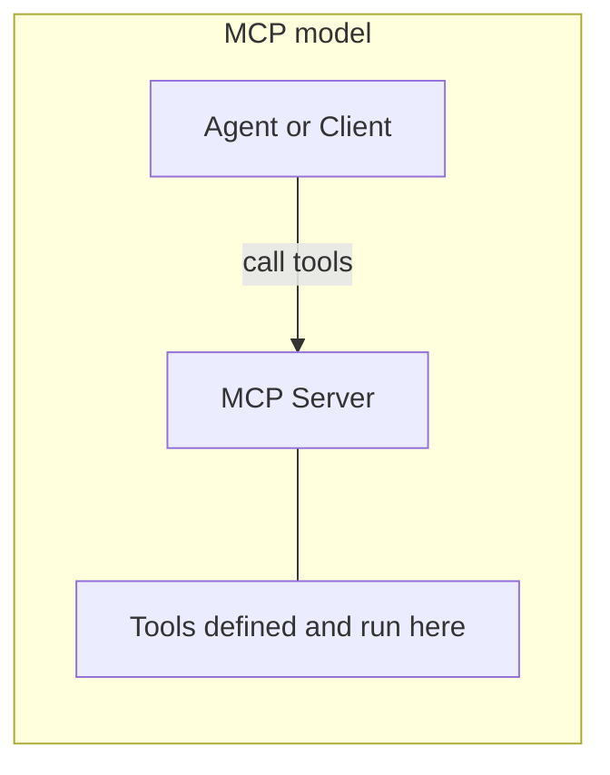
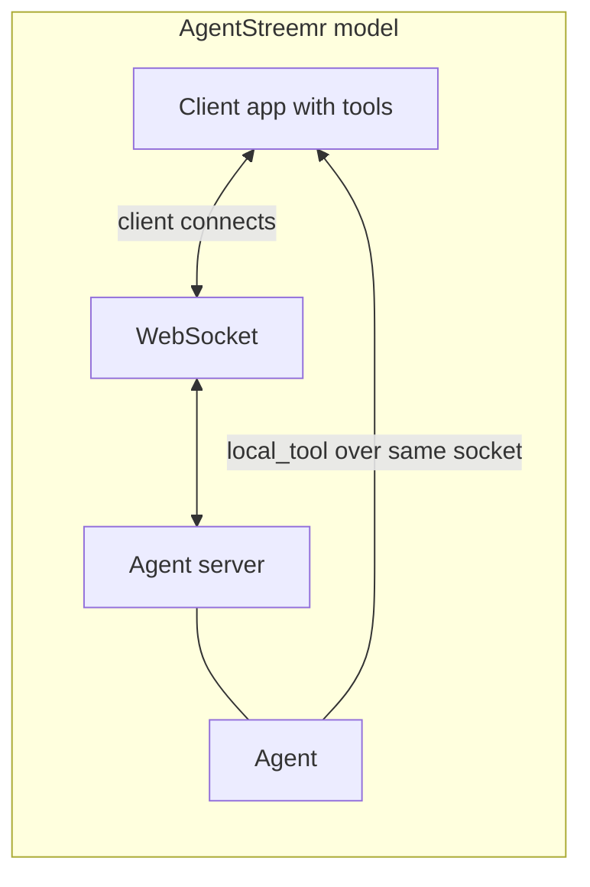

# @eetr/agent-streemr

**Reusable [Socket.io](https://socket.io) + LangChain agent plumbing.**

`@eetr/agent-streemr` extracts the communication protocol, socket listener, local-tool registry, and stream adapter from a production LangChain/LangGraph agent into a standalone, dependency-tiered library — so you can build agents that use the same protocol with any tools or LLM, without rewriting the plumbing.

Key takeaways:

- 🔐 Run agents server-side (no secrets shipped to clients)
- 🧰 Call client-side tools safely over a protocol ("local tools")
- ⚡ Stream real-time UX over WebSockets ([Socket.io](https://socket.io))
- 🔁 Iterate on agents without waiting for client app releases

## Why this exists

Building copilots that run on client devices (web browsers, native mobile apps, desktop clients) is hard and risky — even when the *data* and *useful functions* live locally.

### ❌ Option A: call the LLM from the device

This usually means embedding an AI provider API key in the client.

🔑 In practice, that key should be treated as compromised by default: a motivated attacker can extract it and use it for anything.

Even if you accepted that risk, client-side LLM calls make it difficult to:

- 🚦 enforce rate limits and usage controls
- 🚫 revoke or ban misbehaving users
- 🧨 safely access higher-privilege integrations (e.g. service accounts) without expanding the blast radius to every installed client
- 🔄 rotating those keys would be nearly impossible without disrupting service

### ❌ Option B: expose an "agent API" from the server

This helps with security and governance, but introduces new pain:

- 🧾 you now have to version and evolve an API surface
- 🧩 for each use case, the client must decide the sequence of calls and what information to send (you end up baking "agent behavior" into every client)
- 🐢 in copilot scenarios, you typically want the agent to decide what's best and to be continuously improved through observation and iteration — which clashes with slow client release + rollout cycles (especially on native/mobile)
- 🕒 responsiveness can suffer, especially when the UI needs tight interaction loops
- 📱 native/mobile clients are often out of date, making upgrades and protocol changes slow to roll out

### ✅ The agent-streemr approach: hybrid + inversion of control

Run the agent on a server (so secrets, policies, and integrations stay centralized), while still letting the agent *act as if it were local* by calling client-side tools over a dedicated protocol.

🔄 This implements an inversion of control: the server-side agent decides when and how the client supplies information (via local tools), so you can deliver better value through iteration on the agent without requiring client code changes.

✨ The result is a system that feels like a local copilot, but is operated like a server product.



## How it works

At a high level, your app UI connects to an agent running on a server over WebSockets ([Socket.io](https://socket.io)), and the connection is designed to be secured with JWT-based authentication.

JWTs don't just authenticate the user — they also let the server enforce authorization policies and scope requests to the right tenant/thread (e.g. per user or per installation).

A key concept is **client-side tools** ("local tools"): client-implemented functions invoked by the server-side agent over the socket. They let the agent access device-local data and capabilities without moving the agent (or secrets) onto the device.

Once connected, the agent runs a tight control loop:

- The user sends a `message`.
- The agent decides what to do next.
- It may emit one or more `local_tool` calls (each with a `request_id`).
- The client executes them (or denies them) and replies with `local_tool_response`.
- The agent incorporates results and either requests more tools or returns an `agent_response`.

The agent can use three categories of tools:

- **Server-side tools**: your own backend capabilities (databases, APIs, business logic).
- **Client-side tools (local tools)**: functions that run on the user's device and can access local data (device state, files, sensors, UI prompts).
- **LLM-provider tools**: capabilities offered by the model vendor (where applicable), invoked by the agent alongside your tools.

Quick takeaways:

- 🌐 Client connects via WebSockets and streams responses
- 🤖 The agent runs on the server and decides what to do next
- 📲 The agent can invoke client-side capabilities through `local_tool`
- 🧩 The agent can also call server tools and LLM-provider tools

Example sequence (local tools):

Note: depending on the tool mode, the agent may await the response (`sync`), continue and handle it later (`async`), or emit one-way events (`fire_and_forget`).



## How AgentStreemr differs from MCP

Both [MCP](https://modelcontextprotocol.io) (Model Context Protocol) and AgentStreemr let agents use tools, but they target different tool locations and network models.

### MCP: tools on a known, reachable server

With MCP, tools live on a **server** that the agent (or client) can reach at a known address (URL, host:port, or stdio). The agent calls tools by sending requests to that server over HTTP, WebSocket, or stdio. The tool implementation runs on that server, which is explicitly deployed and addressable.



### AgentStreemr: tools on the client, over the existing connection

With AgentStreemr, tools run on the **client** (browser, mobile app, desktop). The client is usually not reachable via public IPs or sockets — it sits behind NAT, has no open ports, or is not a server at all. The agent server does not "know" the client as a separate addressable service. The **client** initiates the connection to the agent server; when the agent needs a client capability, it sends a `local_tool` request over that **same** socket. There is no second connection or discovery step.



### Comparison

| | MCP | AgentStreemr |
|---|-----|--------------|
| **Where tools run** | On a known, reachable server | On the client (device) |
| **Who is addressable** | MCP server has URL/host/port | Client is not a public server; agent cannot "call" the client directly |
| **Who initiates** | Agent or client calls the MCP server | Client connects to agent server; agent uses that connection for `local_tool` |
| **Agent knows tool location** | Yes — agent targets the MCP server | No — agent sends over the socket to the already-connected client |

### Define on the server, implement on the client

Clients are considered **compromised by default**. In AgentStreemr, clients do **not** define tools (names, schemas, descriptions, or what gets sent to the LLM). They only **implement** the tools that the server defines. That separation reduces risk:

- **Security**: A compromised client cannot inject new tool definitions or change tool contracts.
- **Prompt engineering**: The client cannot influence the agent's tool list or descriptions, so it cannot inject malicious tool definitions into the prompt.
- **Data exposure**: The server controls which tools exist and what parameters they accept; the client cannot expand the surface area of data the agent can request.

With MCP, tool definitions typically live on the same (trusted) MCP server that implements them. With AgentStreemr, the **agent server** is the single source of truth for tool definitions; the client is an untrusted executor only.

## Benefits

Security and governance:

1. **No LLM supplier credentials on the client**: the LLM API key (and any other privileged credentials) stay server-side, so you don't ship secrets to untrusted devices.
2. **Policy-based denial of service**: the agent service can rate-limit, block, or deny requests based on server-side policies (abuse prevention, quotas, auth, compliance).
3. **Tighter privacy controls**: you can enforce what data is allowed to leave the device and what data is allowed to reach external systems, with auditable server-side enforcement.
4. **User-controlled access via allowlists**: the client can require explicit approval (allowlists / human-in-the-loop) before a local tool runs or before sensitive fields are returned, so the user stays in control of what the agent can access.

Iteration and quality:

1. **Centralized monitoring and continuous improvement**: because the agent runs server-side, you can observe and debug behavior from one place (for example with LangSmith traces), measure quality, and iterate safely over time.
2. **Update agents without breaking old clients**: the server-side agent can evolve independently; clients only need to understand the stable socket protocol and the set of local tools they implement.

Capabilities and UX:

1. **Server integrations + push back to the client**: the agent service can call databases and third-party integrations, then stream results back to the client in real time.
2. **Client controls how data is shared**: local tools can shape, redact, summarize, or gate what they send back to the agent instead of being forced to satisfy a rigid server API contract.

## What you can build with this

- A mobile training coach that reads recent workouts from on-device storage and asks for additional context via an allowlisted prompt.
- A browser copilot that can inspect the current page state locally and stream suggested edits back to the UI.
- An enterprise assistant that queries internal databases/server integrations, then requests sensitive user/device info only when needed.

---

## Packages

| Package | Description | Status |
|---------|-------------|--------|
| [`agent-streemr`](./agent-streemr) | Core library: protocol types, socket listener, registry, adapter, LangChain factory | ✅ Ready |
| [`agent-streemr-react`](./agent-streemr-react) | React hooks and context for connecting a UI to an agent-streemr server | ✅ Ready |
| [`agent-streemr-swift`](./agent-streemr-swift) | Native Swift client for iOS, macOS, tvOS and watchOS (Swift Package Manager) | ✅ Ready |
| [`agent-streemr-sample`](./agent-streemr-sample) | Full-stack reference app: LangGraph agent + React/Vite chat UI with recipe management | ✅ Ready |
| [`agent-streemr-sample/client-ipad`](./agent-streemr-sample/client-ipad) | Native SwiftUI iPad sample app demonstrating the full protocol with the same cooking copilot | ✅ Ready |

---

## Installation

Both the server-side core and the React bindings are published on [npm](https://www.npmjs.com/):

| Package | npm | Use case |
|---------|-----|----------|
| **@eetr/agent-streemr** | [npmjs.com/package/@eetr/agent-streemr](https://www.npmjs.com/package/@eetr/agent-streemr) | Node.js agent server: protocol, socket listener, registry, adapter, LangChain helpers |
| **@eetr/agent-streemr-react** | [npmjs.com/package/@eetr/agent-streemr-react](https://www.npmjs.com/package/@eetr/agent-streemr-react) | React app: hooks and context to connect to an agent-streemr server |

**Server (agent):**

```bash
npm install @eetr/agent-streemr
```

**Client (React):**

```bash
npm install @eetr/agent-streemr-react
```

Peer dependencies (e.g. `socket.io`, `zod`, `@langchain/core`) are listed on each package’s npm page. For a full working app, see [agent-streemr-sample](./agent-streemr-sample).

---

## Quick Start (`agent-streemr`)

After installing `@eetr/agent-streemr` (see [Installation](#installation)), wire the socket listener and local tools on your Node.js server:

```ts
import { createServer } from "http";
import { Server } from "socket.io";
import {
  createAgentSocketListener,
  LocalToolRegistry,
  createLocalTool,
  EMIT_LOCAL_TOOL_KEY,
  EMIT_LOCAL_TOOL_FIRE_FORGET_KEY,
  SYNC_REGISTRY_KEY,
} from "@eetr/agent-streemr";
import { z } from "zod";

// 1. Define your per-thread context shape
type MyCtx = { userId: string };

// 2. Define local tools (run on the client, result returned to agent)
const getLocation = createLocalTool({
  tool_name: "get_location",
  schema: z.object({}),
  buildRequest: () => ({}),
  description: "Get the user's current location from the client.",
  mode: "sync",   // agent awaits the client's response before continuing
});

// 3. Create the registry (optional — needed only for async/sync callbacks)
const registry = new LocalToolRegistry<MyCtx>();

// 4. Wire the listener
const io = new Server(createServer(), { cors: { origin: "*" } });

createAgentSocketListener({
  io,
  authenticate: async (socket) => {
    const token = socket.handshake.auth?.token as string | undefined;
    if (!token || !(await verify(token))) return null; // null rejects the connection
    const threadId = socket.handshake.auth?.installation_id as string;
    return { threadId };
  },
  createContext: (_threadId) => ({ userId: "unknown" }),
  localToolRegistry: registry,
  getAgentRunner: (threadId, agentId?) =>
    async (message, { threadId, emitLocalTool, emitLocalToolFireAndForget, localToolRegistry }) => {
      // Build your LangGraph agent here
      const stream = await agent.stream(
        { messages: [{ role: "user", content: message }] },
        {
          configurable: {
            thread_id: threadId,
            [EMIT_LOCAL_TOOL_KEY]: emitLocalTool,
            [EMIT_LOCAL_TOOL_FIRE_FORGET_KEY]: emitLocalToolFireAndForget,
            [SYNC_REGISTRY_KEY]: localToolRegistry,
          },
        }
      );
      return stream;
    },
});
```

---

## Architecture

```
@eetr/agent-streemr
├── protocol/           # Types + parse utilities — zero runtime deps
│   ├── events.ts       # All socket event payload types (C→S and S→C)
│   ├── localTool.ts    # local_tool envelope types + strict parser
│   └── stream.ts       # AgentStreamEvent union type
├── server/             # Socket.io server-side utilities — depends on socket.io
│   ├── listener.ts     # createAgentSocketListener()
│   ├── adapter.ts      # AgentStreamAdapter: event → socket.emit bridge
│   ├── queue.ts        # ThreadQueue: FIFO per-thread task serialisation
│   └── registry.ts     # LocalToolRegistry: processor dispatch + sync awaiting
└── langchain/          # LangChain helpers — depends on @langchain/core
    └── localTool.ts    # createLocalTool() factory (async / sync / fire-and-forget)
```

**Dependency tiers:**

- `protocol/` — no runtime deps; safe for client SDKs
- `server/` — `socket.io` peer dep
- `langchain/` — `@langchain/core` + `zod` peer deps

---

## Quick Start (`agent-streemr-swift`)

```swift
import AgentStreemrSwift

// 1. Configure
let config = AgentStreamConfiguration(
    url: URL(string: "https://api.example.com")!,
    token: bearerJWT
)

// 2. Create stream — @Observable, @MainActor
let stream = AgentStream(configuration: config)

// 3. Register local tools (optional)
await stream.registerTool("get_location") { _ in
    let loc = try await LocationService.shared.current()
    return .success(responseJSON: ["lat": loc.latitude, "lon": loc.longitude])
}

// 4. Connect
stream.connect(threadId: UIDevice.current.identifierForVendor!.uuidString)

// 5. Inject via environment (SwiftUI / iOS 17+)
WindowGroup { ContentView().environment(stream) }

// 6. In a view
@Environment(AgentStream.self) private var stream
stream.sendMessage("Hello!")
```

Add the package via Swift Package Manager (Xcode → **File → Add Package Dependencies**) or in `Package.swift` (repo: [https://github.com/eetr-ai/agent-streemr](https://github.com/eetr-ai/agent-streemr)):

```swift
dependencies: [
    .package(url: "https://github.com/eetr-ai/agent-streemr", from: "0.1.4"),
],
targets: [
    .target(name: "MyApp", dependencies: [
        .product(name: "AgentStreemrSwift", package: "agent-streemr"),
    ]),
]
```

See [agent-streemr-swift/README.md](./agent-streemr-swift/README.md) for the full integration guide (Combine publishers, allow-lists, `LocalToolCoordinator`, UIKit usage, etc.).

---

## Socket Protocol

### Client → Server

| Event | Payload | Description |
|-------|---------|-------------|
| `client_hello` | `{ version, agent_id?, inactivity_timeout_ms? }` | Handshake sent on connect; requests optional agent routing and inactivity timeout |
| `message` | `{ text, context?, attachment_correlation_id? }` | Trigger an agent run; optionally references staged attachments |
| `start_attachments` | `{ correlation_id, count }` | Begin a multi-file upload sequence before sending a message |
| `attachment` | `{ correlation_id, seq, type, body, name? }` | One attachment in the sequence (Base64-encoded body); resets inactivity timer |
| `local_tool_response` | `{ request_id, tool_name, response_json? \| allowed:false \| notSupported:true \| error:true }` | Reply to a `local_tool` request |
| `clear_context` | — | Reset conversation history for this thread |

### Server → Client

| Event | Payload | Description |
|-------|---------|-------------|
| `welcome` | `{ server_version, capabilities: { max_message_size_bytes, inactivity_timeout_ms } }` | Handshake reply with negotiated server capabilities |
| `internal_token` | `{ token }` | Agent reasoning token (thinking panel) |
| `local_tool` | `{ request_id, tool_name, args_json, tool_type, expires_at? }` | Delegate work to client |
| `attachment_ack` | `{ correlation_id, seq }` | Idempotent confirmation that one attachment was staged |
| `agent_response` | `{ chunk?, done }` | Final assistant reply |
| `inactive_close` | `{ reason }` | Server is closing the connection due to inactivity |
| `context_cleared` | `{ message }` | Broadcast: context was reset |
| `error` | `{ message }` | Error notification |

`createLocalTool` supports three execution modes:

### `"async"` (default)

Emit `local_tool`, return immediately, let the agent continue. The listener re-enqueues a follow-up run when `local_tool_response` arrives.

```ts
const tool = createLocalTool({ tool_name: "get_prefs", schema, buildRequest, description: "...", mode: "async" });
```

### `"sync"`

Emit `local_tool`, then **await** the client response before returning to LangChain. The tool call resolves with the client's data (or `{ status: "error", errorMessage: "timeout" }` after `ttlMs`).

```ts
const tool = createLocalTool({
  tool_name: "confirm_action",
  schema: z.object({ action: z.string() }),
  buildRequest: (args) => ({ action: args.action }),
  description: "Ask the client to confirm an action.",
  mode: "sync",
  ttlMs: 20_000,
});
```

### `"fire_and_forget"`

Emit `local_tool` with no tracking. The client does not send `local_tool_response`. Use for one-way notifications or side-effects.

```ts
const tool = createLocalTool({
  tool_name: "notify",
  schema: z.object({ message: z.string() }),
  buildRequest: (args) => ({ message: args.message }),
  description: "Push a one-way notification to the client.",
  mode: "fire_and_forget",
});
```

---

## `LocalToolRegistry` API

```ts
const registry = new LocalToolRegistry<MyCtx>();

// Register a processor
registry.register("tool_name", {
  onSuccess:      (ctx, responseJson) => { /* mutate ctx */ },
  onDenied:       (ctx)               => { /* user denied */ },
  onNotSupported: (ctx)               => { /* client doesn't support this */ },
  onError:        (ctx, errorMessage) => { /* client error */ },
});

// Track an emitted request (done automatically by createAgentSocketListener)
registry.trackEmit({ threadId, request_id, tool_name, nowMs: Date.now(), ttlMs: 30_000 });

// Handle an incoming response (done automatically by createAgentSocketListener)
registry.handleResponse({ ctx, threadId, request_id, tool_name, status, responseJson });

// Sync-mode: await a response with TTL
const result = await registry.awaitResponse({ threadId, request_id, tool_name, ttlMs: 20_000 });
// result: { status: "success" | "denied" | "not_supported" | "error", responseJson?, errorMessage? }

// Count pending requests for a thread (used to decide passive vs active follow-up)
registry.getAwaitingCount(threadId);

// On clear_context: resolves pending sync awaiters with status "error"
registry.clearThread(threadId);
```

---

## `ThreadQueue` API

```ts
const queue = new ThreadQueue();

// Enqueue a task; runs after any currently active task for the same threadId
queue.enqueue(threadId, async () => { /* ... */ });

// Check if there's an active/pending task
queue.has(threadId);  // boolean

// Remove tracking state (call on clear_context)
queue.clear(threadId);
```

---

## `AgentStreamAdapter` API

Bridges an `AsyncIterable<AgentStreamEvent>` to the correct socket emissions:

```ts
const adapter = new AgentStreamAdapter(socket);
try {
  await adapter.run(agentStream);
} catch (err) {
  socket.emit("error", { message: String(err) });
}
```

---

## `createAgentSocketListener` Options

```ts
createAgentSocketListener({
  io,                     // Socket.io Server instance
  authenticate,           // (socket) => Promise<{ threadId, ...} | null>
  createContext,          // (threadId) => TContext  — called once per new thread
  getAgentRunner,         // (threadId, agentId?) => AgentRunner<TContext>
  localToolRegistry,      // LocalToolRegistry<TContext> instance
  buildFollowUpMessage?,  // custom follow-up message builder (optional)
  onError?,               // custom error handler (optional; default: socket.emit("error"))
  localToolTtlMs?,        // TTL for awaiting entries (default: 30 000 ms)
  maxMessageSizeBytes?,   // max size for messages and attachments (default: 5 MiB)
  inactivityTimeoutMs?,   // server-side inactivity cap; emits inactive_close then disconnects
});
```

---

## Development

```bash
# Install all workspace dependencies
npm install

# Type-check all packages
npm run typecheck

# Run all tests
npm test

# Build all packages
npm run build
```

---

## License

Apache 2.0 — see [agent-streemr/LICENSE](./agent-streemr/LICENSE).
Copyright 2026 Juan Alberto Lopez Cavallotti.
