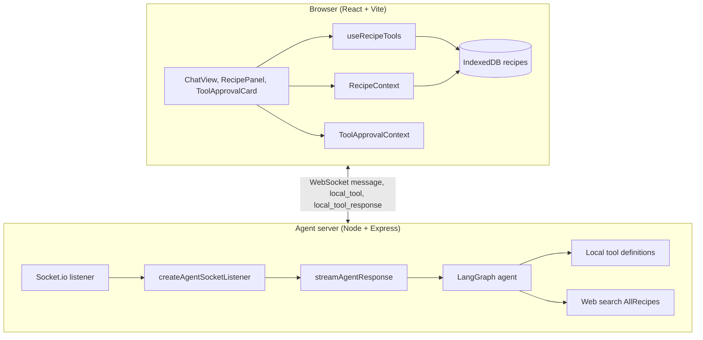
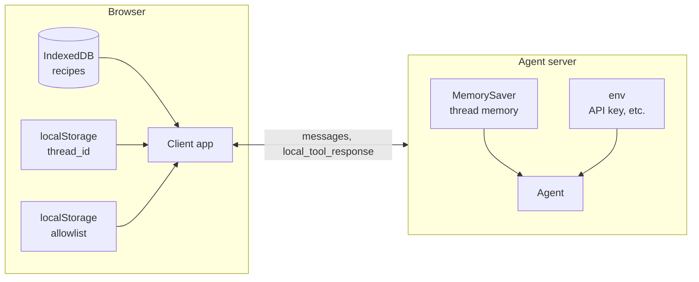
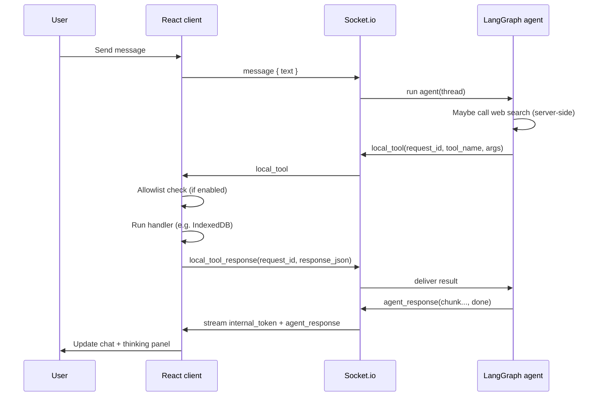
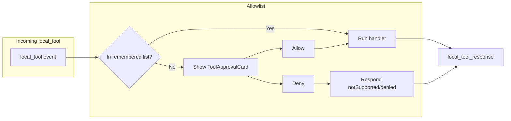

# agent-streemr-sample

Full-stack reference app for **@eetr/agent-streemr**: a LangGraph-powered cooking copilot with a React/Vite chat UI and **recipe management via client-side local tools**. Recipe data stays in the browser (IndexedDB); the agent runs on the server and never sees your data until you send a message or approve a tool call.

This README explains how the sample maps to the [main library README](../README.md): architecture, where data lives, which tools exist, and where to find the patterns in code.

---

## How this sample reflects the main README

The [main README](../README.md) describes:

- **🔐 No secrets on the client** — The LLM API key and AllRecipes-scoped web search live only on the agent server. The browser never gets them.
- **🧰 Local tools** — The agent calls *client-side* tools (e.g. `recipe_list`, `recipe_create`, `recipe_save`) over the socket. The client runs them against IndexedDB and returns results; the server never stores recipes.
- **⚡ Streaming** — Chat and “thinking” tokens stream over WebSockets for real-time UX.
- **🔁 Inversion of control** — The server-side agent decides *when* to call which tool; the client only implements the tools and (optionally) an allowlist. You can change agent behavior without shipping new client builds.

This sample is a concrete implementation of that design: one agent, one React client, and a clear split between server-only capabilities (LLM + web search) and client-only data (recipes).

---

## Architecture



**Directory layout:**

```
agent-streemr-sample/
├── agent/                    # Node.js server — agent + Socket.io
│   ├── src/
│   │   ├── bootstrap/        # Express, HTTP server, Socket.io, createAgentSocketListener
│   │   └── agent/            # LangGraph agent, prompt, tools (local tool definitions)
│   └── ...
└── client/                   # React + Vite SPA
    ├── src/
    │   ├── db/               # IndexedDB persistence (recipes)
    │   ├── context/          # RecipeContext, ToolApprovalContext
    │   ├── hooks/            # useRecipeTools (local tool handlers)
    │   └── components/       # ChatView, RecipePanel, ThinkingPanel, ToolApprovalCard, …
    └── ...
```

**Flow:**

1. **Client** connects to the agent over WebSockets (Socket.io), with a stable `threadId` (e.g. from `localStorage`).
2. **Agent** authenticates the connection (in this sample, by `installation_id` only; no JWT), then runs a LangGraph agent with a memory checkpointer keyed by `threadId`.
3. User sends a **message** → agent may call **server-side tools** (e.g. web search) and **local tools** (recipe APIs). Local tool calls are sent to the client as `local_tool` events; the client runs them (e.g. against IndexedDB), then replies with `local_tool_response`.
4. **Streaming**: the agent streams `internal_token` (thinking) and `agent_response` chunks to the client; the UI shows a thinking panel and incremental assistant messages.

Key entry points:

| Layer        | Entry / wiring |
|-------------|-----------------|
| Server      | [agent/src/bootstrap/index.ts](agent/src/bootstrap/index.ts) → [server.ts](agent/src/bootstrap/server.ts) (Express + Socket.io + `createAgentSocketListener`) |
| Agent run   | [agent/src/agent/index.ts](agent/src/agent/index.ts) → [stream.ts](agent/src/agent/stream.ts) (LangGraph stream, `buildLangChainConfig`, local tools) |
| Client app  | [client/src/App.tsx](client/src/App.tsx) (`AgentStreamProvider`, `ToolApprovalProvider`, `RecipeProvider`, `useRecipeTools`) |
| Client data | [client/src/db/recipes.ts](client/src/db/recipes.ts) (IndexedDB); [client/src/context/RecipeContext.tsx](client/src/context/RecipeContext.tsx) (list + selection) |

---

## Where the data lives



| Data | Location | Who can access it |
|------|----------|-------------------|
| **Recipes** (name, ingredients, instructions, tags, etc.) | Browser **IndexedDB** (`agent-streemr-recipes`), via [client/src/db/recipes.ts](client/src/db/recipes.ts) | Only the client. The agent never reads or stores recipes; it only invokes local tools that run in the browser and return results. |
| **Conversation state / thread memory** | Server (LangGraph **MemorySaver**), keyed by `threadId` | Agent only. Used for multi-turn context. |
| **Allowlist “remembered” tools** | Browser **localStorage** (`agent-streemr:allowlist`) | Client only. Used by [ToolApprovalContext](client/src/context/ToolApprovalContext.tsx) to auto-approve previously allowed tools. |
| **Thread ID** | Browser **localStorage** (`agent_streemr_thread_id`) | Client only. Sent in the Socket.io handshake so the server can associate the connection with a thread. |
| **LLM API key, web search** | Server **env** (e.g. `OPENAI_API_KEY`) | Agent only. Never sent to the client. |

So: **recipe content and user-owned data stay on the device**; the server only sees what the user sends in chat and what the client returns from local tool calls (and only when the user allows those calls).

---

## Tools

### Server-side tools (run on the agent server)

- **Web search** — Restricted to `allrecipes.com` so the agent can look up recipe templates and ingredient ideas from a single trusted source. Defined in [agent/src/agent/stream.ts](agent/src/agent/stream.ts) via `openAITools.webSearch({ filters: { allowedDomains: ["allrecipes.com"] } })`.

### Local tools (defined on server, executed on client)

All recipe tools are **local tools**: the agent emits `local_tool` with `request_id`, `tool_name`, and `args`; the client runs the logic (e.g. IndexedDB, in-memory drafts) and replies with `local_tool_response`. Definitions live under [agent/src/agent/tools/](agent/src/agent/tools/); implementations live in [client/src/hooks/useRecipeTools.ts](client/src/hooks/useRecipeTools.ts).

| Tool | Mode | Description |
|------|------|-------------|
| `recipe_list` | async | List all recipe summaries (id, name, tags, servings) from IndexedDB. |
| `recipe_get_state` | sync | Return full state of one recipe by id. |
| `recipe_create` | sync | Create a new recipe draft; returns id. |
| `recipe_set_title` | sync | Set recipe name. |
| `recipe_set_description` | sync | Set recipe description. |
| `recipe_set_ingredients` | sync | Set ingredients (with optional `op`: add/remove/update). |
| `recipe_set_directions` | sync | Set instructions. |
| `recipe_save` | sync | Persist current draft to IndexedDB. |
| `recipe_load` | sync | “Open” a recipe in the UI (selection in RecipeContext so the RecipePanel shows it). |

- **async**: agent does not wait for the response; it continues and may get the result in a follow-up turn.
- **sync**: agent waits for the client’s `local_tool_response` before proceeding (with a TTL). Used for create/set/save/load so the agent can sequence steps correctly.

The client also registers a **non-recipe fallback** in `useRecipeTools`: any `local_tool` whose name is not in the recipe set gets an immediate `local_tool_response` with `notSupported: true`.

**Local tool call flow:**



---

## User-controlled tool approval (allowlist)

The sample implements **user-controlled access** as in the main README: the client can require explicit approval before a local tool runs.

- **[ToolApprovalContext](client/src/context/ToolApprovalContext.tsx)** — Provides an `AllowList` whose `check(toolName, args)` returns a Promise that resolves when the user clicks Allow or Deny. “Remember for this tool” persists the tool name in `localStorage` so future calls are auto-allowed.
- **[ToolApprovalCard](client/src/components/ToolApprovalCard.tsx)** — Renders inline in the chat for each pending tool: tool name, formatted args, Allow / Deny, and “Remember for this tool.”
- **useRecipeTools** passes this `allowList` into `useLocalToolHandler(..., { allowList })`, so every recipe tool call goes through the allowlist unless the tool is remembered.

So: **the user sees what the agent is asking for and can allow or deny each request**; optional “remember” reduces prompts for trusted tools.



---

## Links to examples by topic

Use these to see how the sample is built and to copy patterns.

### Server: Socket listener and agent runner

- **[Bootstrap: Express + Socket.io + createAgentSocketListener](agent/src/bootstrap/server.ts)** — CORS, health check, `authenticate` (by `installation_id`), `createContext`, `getAgentRunner`, `localToolRegistry`.
- **[Agent stream and tool wiring](agent/src/agent/stream.ts)** — Model, checkpointer, web search tool, all recipe local tools, `streamAgentResponse` (async generator yielding `internal_token` / `agent_response`), `buildLangChainConfig(options)`.
- **[Local tool definitions (server)](agent/src/agent/tools/)** — e.g. [recipeList.ts](agent/src/agent/tools/recipeList.ts) (async), [recipeCreate.ts](agent/src/agent/tools/recipeCreate.ts) (sync). Each uses `createLocalTool` from `@eetr/agent-streemr` with `tool_name`, `description`, `schema` (zod), `buildRequest`, `mode`.

### Client: Connection and providers

- **[App and providers](client/src/App.tsx)** — `AgentStreamProvider` (url, token), `ToolApprovalProvider`, `RecipeProvider`; threadId from localStorage; `useRecipeTools(socket)`; `setContext` for selected recipe id.
- **[Recipe tools hook](client/src/hooks/useRecipeTools.ts)** — Registers every recipe local tool with `useLocalToolHandler`, in-memory drafts for setter tools, and the non-recipe fallback. Passes `allowList` from `useToolApproval()`.

### Client: Data and context

- **[IndexedDB recipes](client/src/db/recipes.ts)** — Schema, `getAllRecipes`, `getRecipe`, `saveRecipe`, `deleteRecipe`, `notifyRecipesUpdated` (dispatches `recipes-updated` so the UI refreshes).
- **[RecipeContext](client/src/context/RecipeContext.tsx)** — Recipe list, selected id, load from DB, listen for `recipes-updated`, select/deselect/delete.
- **[ToolApprovalContext](client/src/context/ToolApprovalContext.tsx)** — AllowList implementation, pending approvals, approve/deny/remember/forget, localStorage persistence.

### Client: UI and styles

- **[ChatView](client/src/components/ChatView.tsx)** — Status badge, message list, pending-approval cards, thinking panel, loading dots, input form. Uses `useAgentStreamContext()` for `messages`, `sendMessage`, `clearContext`, `isStreaming`, `internalThought`, `error`, and `useToolApproval()` for `pendingApprovals`, `approve`, `deny`.
- **[MessageBubble](client/src/components/MessageBubble.tsx)** — User vs assistant styling; assistant messages use markdown (marked + DOMPurify). User: blue bubble, right-aligned; assistant: slate bubble, left-aligned, with streaming cursor.
- **[ThinkingPanel](client/src/components/ThinkingPanel.tsx)** — Inline “Thinking” card with sliding window of `internalThought` text, monospace, max height; only rendered when there is content.
- **[ToolApprovalCard](client/src/components/ToolApprovalCard.tsx)** — Inline card for one pending tool: amber header, tool name, args list, “Remember for this tool” checkbox, Allow (emerald) / Deny (slate) buttons.
- **[RecipePanel](client/src/components/RecipePanel.tsx)** — Left column: recipe list (from RecipeContext) with refresh and delete; right: selected recipe viewer (title, meta, description, ingredients, instructions, markdown-rendered). Styling: slate palette, borders, tags, last-updated footer.

### Agent behavior

- **[System prompt](agent/src/agent/prompt.ts)** — Cooking copilot role, use of AllRecipes search, recipe tool workflows (create vs edit), when to call `recipe_load` so the recipe appears in the panel, and that recipe content should stay in the editor, not in chat.
- **[User context](agent/src/agent/userContext.ts)** — `UserContext` (e.g. `selectedRecipeId`), `buildContextualMessage` to prepend “[Editor context]” so the agent knows which recipe is open without the user saying it every time.

---

## Run the sample

**Agent (server):**

```bash
cd agent
cp .env.example .env   # set OPENAI_API_KEY
npm install
npm run dev
```

Listens on `http://localhost:8080` (configurable via `PORT`). Health: `http://localhost:8080/health`.

**Client:**

```bash
cd client
cp .env.example .env   # optional: VITE_AGENT_URL if agent is not on localhost:5173 proxy
npm install
npm run dev
```

Uses Vite; by default it can proxy to the agent or use `VITE_AGENT_URL`. Open the app in the browser, connect, and try e.g. “Find a simple pasta recipe” or “Create a recipe for garlic bread.”

---

## Summary

- **Architecture**: Agent (Node + Socket.io + LangGraph) + React client; agent defines local tools, client implements them and owns recipe data.
- **Data**: Recipes and allowlist state in the browser; thread memory and API keys on the server.
- **Tools**: One server-side tool (AllRecipes-scoped web search); nine local recipe tools (list, get, create, set_*, save, load), with sync/async as in the main README.
- **UX**: Streaming chat, thinking panel, inline tool-approval cards, and a dedicated recipe panel so the agent and user can work with recipes without pasting them into the thread.

For the protocol and API details (events, payloads, `createLocalTool` modes, `LocalToolRegistry`), see the [main README](../README.md).
